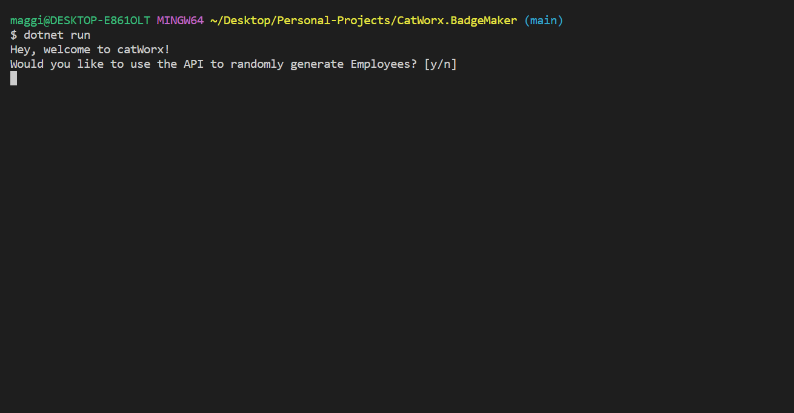
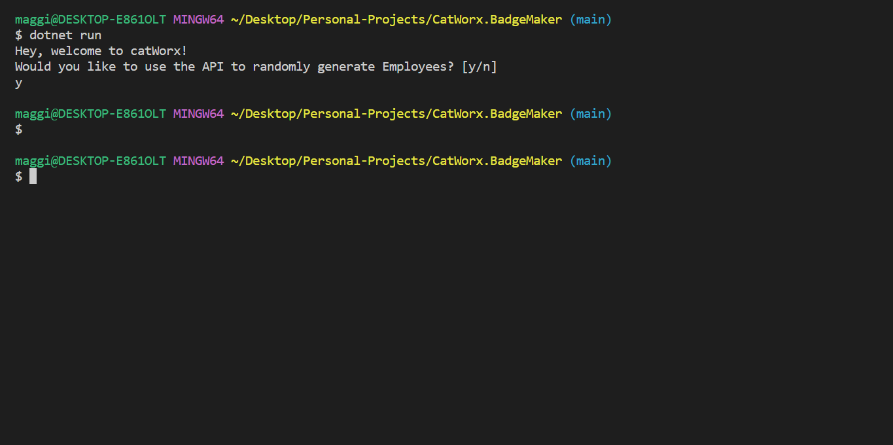
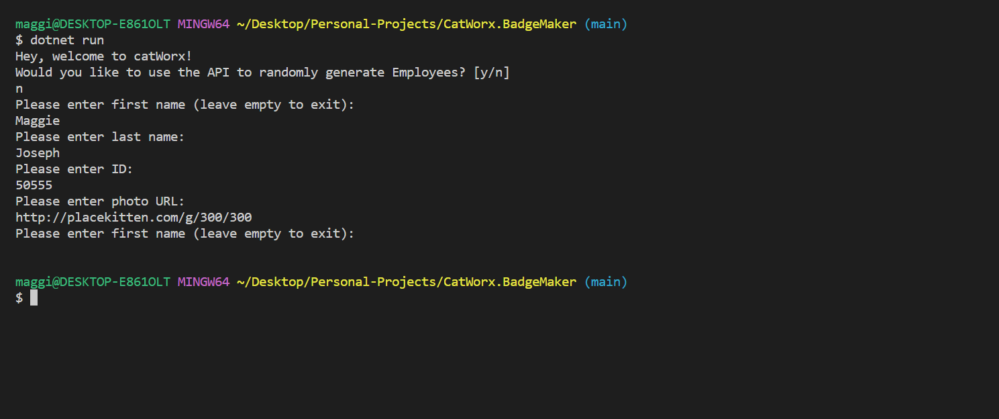

# Badge Maker

## Table of Contents
  * [Description](#description)
  * [Screenshots](#screenshots)
  * [Deployment](#deployable-links)
  * [Technologies Used](#technologies-used)
  * [Contribution](#contribution)


## Description
This is my first C# application I've created. It is driven by prompts in the console where you can create employee badges with your company name, employee name, employee id and employee photo. Checkout the deployment section on how get the application running on your device.


## Screenshots
This is what the application will look like when you first start the application


This is what the application will look like if you choose to create randomly genereated badges


this is what the application will look like if you choose to manually create a badge(s)



## Deployment
* If you do not have the C# extention, feel free to click [here](https://marketplace.visualstudio.com/items?itemName=ms-dotnettools.csharp) to download it now so you are able to run this application
* If you don't have a .NET Core SDK installed, click [here](https://learn.microsoft.com/en-us/dotnet/core/sdk#how-to-install-the-net-sdk) to install. This will install everything you need to run this application and build new C# applications
* Ensure you have an image link you can use to upload into the badge maker. If you don't, use [this](http://placekitten.com/g/300/300) placeholder image of a kitten
* Once .NET core SKD is running clone or fork this repository
* At the root directory, on the command line, add the following line
```
dotnet run
```
* Follow the prompts in the command line to see the functionality of this application
* You can view your created badges and a csv file with all employee data in the data directory
* Enjoy!


## Technologies Used
* C#
* Git
* Server-side API (https://randomuser.me/api/)


## Contributions
This application was build through a C# lesson with the University of Toronto and finalized with personal documentation research. 